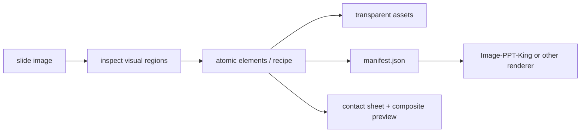

# Image Split

Split flat slide or page images into editable-ready visual layers.

Image Split is the visual-preparation layer for image-to-PPT reconstruction. It turns a single PNG/JPG slide into named transparent assets, placement metadata, contact sheets, text masks, and optional region schemas that downstream tools can trust.

## Why It Exists

Most screenshot-to-PPT workflows fail because they treat OCR boxes or connected components as the source of truth. Image Split uses a stricter contract:

- OCR is evidence for text masks, not the final visual boundary.
- Simple UI geometry is redrawn as clean shapes or crisp transparent assets.
- Complex visuals such as logos, icons, charts, photos, diagrams, and illustrations are extracted as separately named assets.
- Every production asset should map to an intentional design object, not an arbitrary pixel fragment.
- QA artifacts are part of the output, not an afterthought.

## Pipeline



## Quick Start

Install Python dependencies:

```bash
python -m venv .venv
source .venv/bin/activate
pip install -r requirements.txt
```

Run the atomic asset splitter:

```bash
python skills/image-split/scripts/atomic_asset_split.py \
  --image examples/demo/input.png \
  --elements examples/demo/elements.json \
  --out outputs/demo
```

The command writes:

- `manifest.json`
- cropped transparent PNG assets
- `assets_contact_sheet.png`
- `composite_no_text_preview.png`

## OCR One-Command Setup

OCR is used as evidence for text masks and content review. The default containerized OCR demo uses Tesseract:

Prerequisite: Docker with Compose v2.

```bash
make ocr-demo
```

or:

```bash
docker compose run --rm ocr-demo
```

This writes `ocr-candidates.json`, `ocr-merged.json`, `ocr-review-report.md`, and `ocr_boxes_preview.png` under `examples/demo/ocr/`.

Optional PaddleOCR support is available when you want a heavier multilingual OCR engine:

```bash
make ocr-paddle-demo
```

See [docs/ocr-tools.md](docs/ocr-tools.md) for the OCR tool matrix, deployment notes, and MinerU integration.

## Routes

- `atomic-assets`: preferred production route. Outputs cropped transparent assets with `position` and `canvas` metadata.
- `copyslides-like region`: creates a semantic region schema first, then uses it as the contract for extraction and PPT reconstruction.
- `visual-skeleton`: quick preview route using broader full-canvas layers. Useful for layout checks, not final editable reconstruction.

## Skill

The reusable agent skill lives at:

```text
skills/image-split/SKILL.md
```

For Codex-style skill installation, copy `skills/image-split/` into your local skills directory and restart the agent.

## Relationship To Image-PPT-King

Image Split can be used independently for visual asset extraction, but it is also the first stage of Image-PPT-King:

```text
flat image -> Image Split assets/schema/OCR evidence -> Image-PPT-King -> editable PPTX
```

## Status

This repository is an open-source packaging pass over a working local workflow. The first public release should focus on reproducible examples, dependency cleanup, and CI smoke tests.
